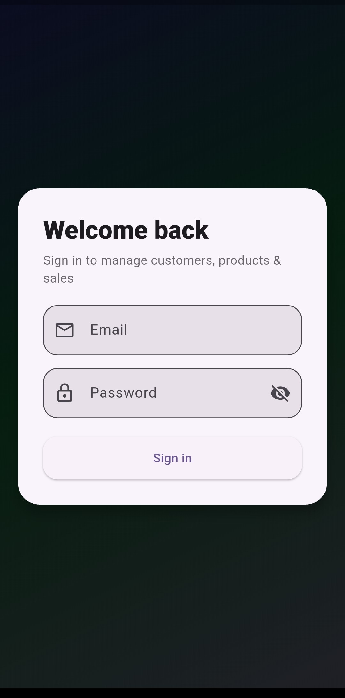
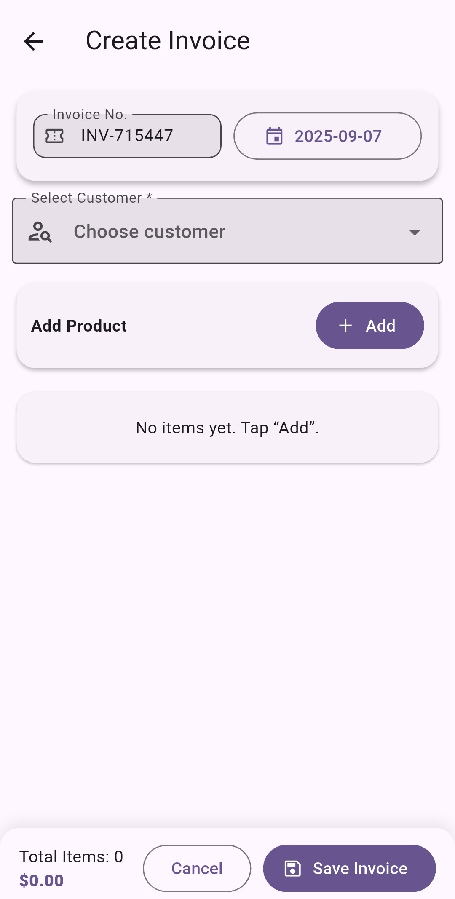
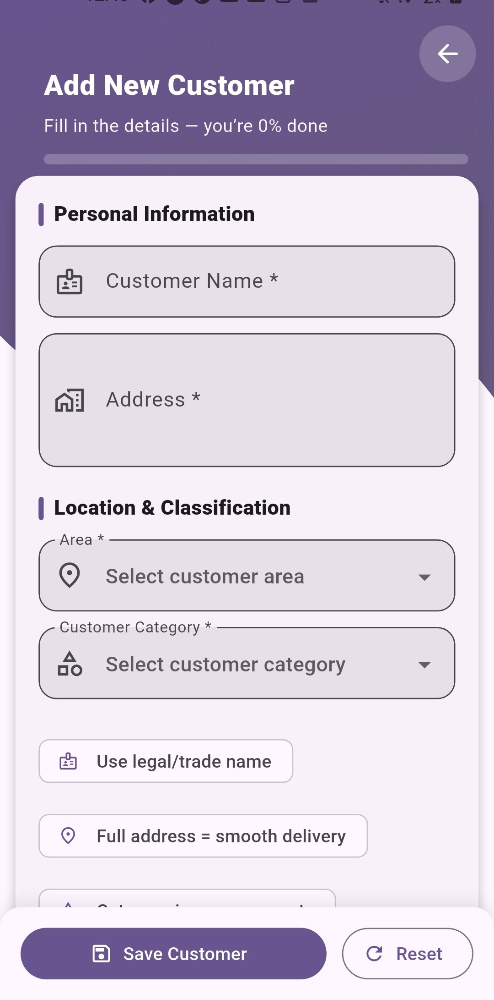
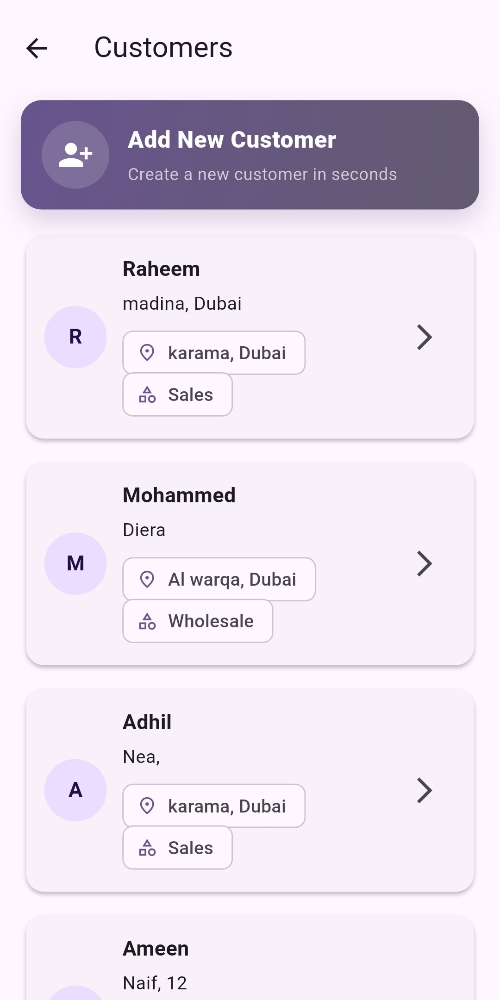
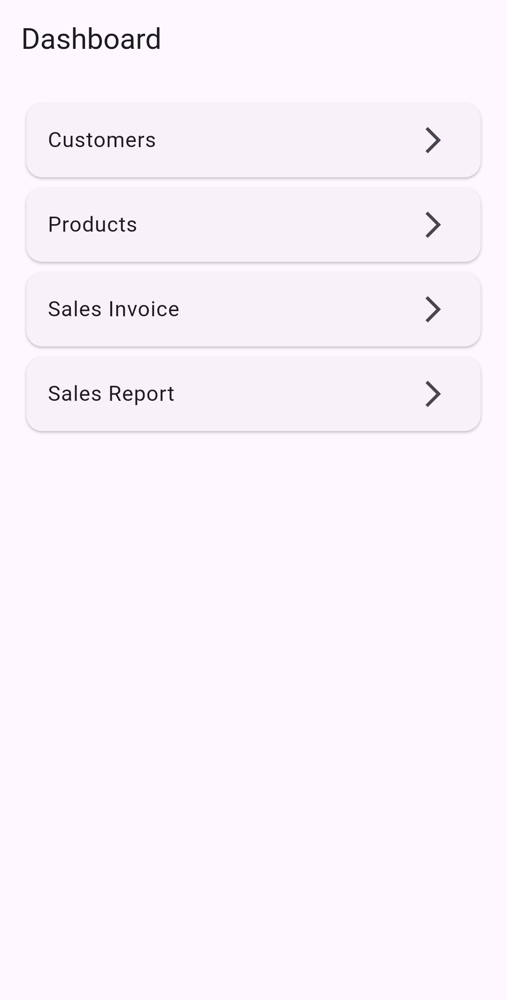
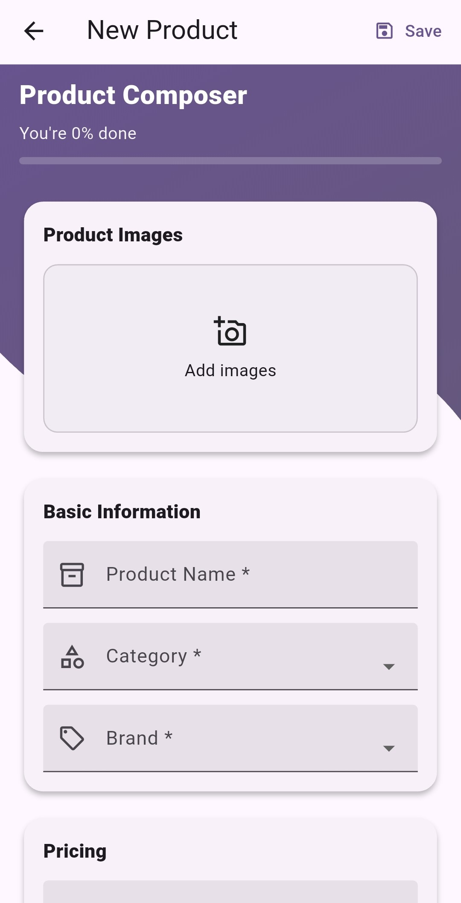
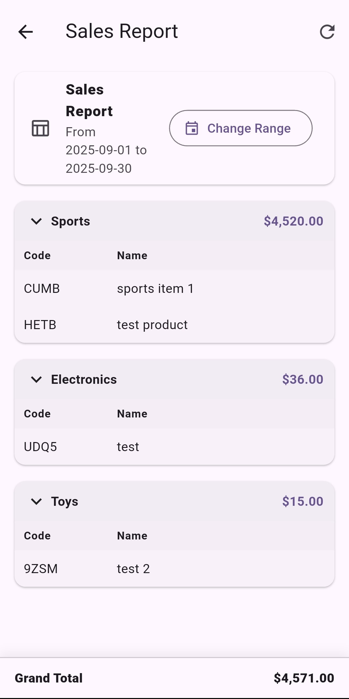

# Sales Test App

## Setup
- Flutter 3.x
- `flutter pub get`
- Run with `flutter run'

## Packages
-   cupertino_icons: ^1.0.8
    firebase_core: ^4.1.0
    firebase_auth: ^6.0.2
    flutter_bloc: ^9.0.0
    flutter_secure_storage: ^9.2.2
    cloud_firestore: ^6.0.1
    image_picker: ^1.1.2
    firebase_storage: ^13.0.1
    cached_network_image: ^3.3.1
    intl: ^0.19.0
    equatable: ^2.0.5

## Architecture
- Clean Architecture (domain/data/presentation) 
- Navigator 2.0 custom RouterDelegate

## Features
- Login (token stored in secure storage)
- Customer & Product CRUD (with dropdown master data, image upload)
- Sales Invoice (multi-line items, qty/rate/discount, totals)
- Sales Report (table + date & customer filters)

>>Project Structure
lib/
src/
core/                 # theme, routes, utils, constants
data/
models/             # DTOs: customer, product, invoice, report, ref items
repositories/       # repository interfaces + Firestore/Storage implementations
presentation/
blocs/              # BLoC/Cubit for each feature
screens/            # UI pages (login, dashboard, customers, products, invoice, report)
widgets/            # reusable UI: dropdowns, pickers, fields, cards

## Screenshots

### Login

### Create Invoice

### Create customer

###  Customer list

###  Dashboard

###  Add product

###  Sales report

>>credentials for user login 

Email: shahenshamohammedam@gmail.com
Password: shahensha12

